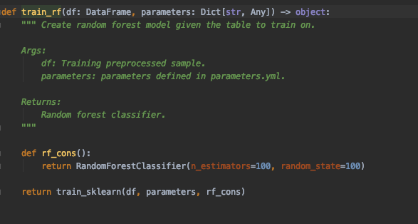
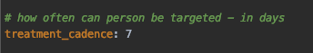

## Overall design

The CVM pipeline consists of following submodules:
- sampling
- data preparation
- modelling
- treatments
- report

To run any pipeline, any tool we need data.
CVM pipeline sources the data from [C360](https://customer360.atlassian.net/wiki/spaces/C3/overview).
The data on C360 may be huge.
In order to speed up the computation and reduce memory usage data is first sampled in sampling submodule.

Once we have reduced data tables we can then proceed to joining the data to create master table for our task of prediction of churn or revenue dilution.
In the end we want to run a model that would predict those so we have to be able to prepare training / test / daily scoring datasets.
It would be also nice to prepare datasets for feature extraction phase.
Sometimes we want to add transformations of existing C360 features.
All of those things are meant to be done in data preparation submodule.

Once we have all features from C360 joined in one big master table we would like to train a model.
But every model requires preprocessing.
Preprocessing pipeline has to be fitted and saved for future reuse.
Once we have preprocessed data we have to split it train and test dataset.
Finally, we can train (multiple) models and save them in Performance AI.
Once we have a model we can use it to create propensity score for every user.
This is the modelling submodule.

The whole purpose of CVM pipeline is to send treatments to clients.
We have the propensities produced, but we still have to map them to treatments and deploy the
treatments to the campaign team. Treatments submodule takes care of that.

To be able to test and learn we have to monitor some chosen KPIs. 
This is the reason why report submodule exists.

Sometimes CVM pipeline's user would like to modify the details of the pipeline's run.
That could include for example scoring date, size of training sample, flags for sending the treatments etc.
These could be changed in `parameters_*.yml` files.

## Sampling submodule
Before any dataset is used it is sampled first. Sampling is done to reduce the amount of data and 
try to minimize time / memory requirements. Sampling procedures vary depending on the purpose
of sampling and can be parametrized using `conf/base/CVM/L5/parameters.yml`.


Sampling is done in stages defined by `stages` field.
Stage called `take_last_date` leaves only the most recent entry available.
If `chosen_date` is supplied then `take_last_date` return last date available for given input
dataset before the date specified in `chosen_date`. If `chosen_date` is left empty then today's date
is used.

Another option is to filter out users. In the case of scoring predefined list of users is used.
For training and feature extraction purposes active users that meet agreed conditions 
(prepaid, active, with proper main packages) are sampled. 

How are users sampled? First `subscription_identifier` is hashed and then users with hash suffix defined
in field `subscription_id_hash_suffix` are picked. Why is that so complicated? Couldn't we just sample
some random percentage? This procedure makes the sample representative (same as random sample) and it
ensures that each time we want to get the same sample we get it. One could argue that the same can 
be achieved with seeds, but this could be more complicated due to spark design.

Sampling is done in `src/cvm/sample_inputs/pipeline.py`.

## Data preparation submodule
Once we have all inputs sampled we prepare them for future use. 
First we join them with `cvm.data_prep.pipeline.join_raw_features`. 
This function can join using both new `subscription_identifer` and an old one, so one can mix
C360 data tables and cloud datasets.

Then targets datasets are created in `cvm.data_prep.pipeline.create_cvm_targets`. 
These are parametrized by `conf/base/CVM/L5/parameters_targets.yml`.


Macrosegments and microsegments are defined using `conf/base/CVM/L5/parameters_microsegments.yml` 
and `conf/base/CVM/L5/parameters_macrosegments.yml`. Microsegments and macrosegments can be modified
by modifying those files.


Important note. Microsegments are recalculated once per `microsegments_update_cadence` days.
If scoring pipeline needs microsegments and finds microsegments not older than 
`microsegments_update_cadence` days in microsegments history then these are used.


## Modelling submodule
The thing that everybody focuses on when talking about CVM projects are the prediction models.
Once we have all data prepared we can preprocess the data, train new models and use already
trained models to predict future revenue dilution / churn propensity. There are multiple models
for multiple macrosegments. All models are validated. Results of validation and models
themselves are saved on Performance AI server.

### How does preprocessing work?
Preprocessing is a process of preparing the data specifically for the models to train / predict.
Preprocessing is done by pipelines listed in `src/cvm/preprocessing/pipeline.py`.
Let's assume that the model we want to use in prediction does not allow for `null` values
in the data. That means that for this model we have to impute those values. This could be not
true for another model class, thus feature imputation is part of preprocessing pipeline.

Imagine we choose to use median imputation strategy. In order to be able to fill missing data
with median we have to first calculate those using training data and use those calculated
median when predicting daily. That means we have to save the medians aside for prediction.
The same remark can be applied to many preprocessing stages that we can do (eg scaling the data).
Because of that preprocessing pipeline has to be trained and saved aside to be used in the future.
Hence the existence of `pipeline_fit` and `pipeline_transform`.

Currently following stages are applied to data in preprocessing pipeline:
- dropping predefined blacklisted columns
- filtering important columns
- changing numerical features to float data types
- filtering out all `null` columns
- indexing string columns
- median imputation of all numerical columns

### What is macrosegments and modelling relation?
Each macrosegment and target have separate targets to be trained to.

### How are models trained?
For each macrosegment and target data is preprocessed and converted to `pandas.DataFrame`.
Then the model is trained using `sklearn` library. Checkout `src/cvm/modelling/nodes.py`.



If you want to change parameters / model itself, modify constructor above. Currently using
`RandomForestClassifier`.

### How are models validated?
Before training of the models validation sample is set aside.
Then trained model is used to predict on the data. The predictions are then used to 
calculate metrics like AUC, precision, recall. 

### What is Performance AI?
Performance AI is a models tracking tool. Every model trained and metric created in validation
stage is saved on Performance AI server. 


Models are saved in a group called `experiment`. One experiment is a set of models for all 
macrosegments.

### How are models used in daily predictions?
Models are loaded from `random_forest` dataset (checkout catalog). These are broadcasted to
`pyspark` nodes. Then, locally on each node, `pyspark` DataFrames are converted to `pandas.DataFrame`
and fed into the model creating the propensity scores.

## Treatments submodule
Treatments are the only reason for existence of C360 pipeline.
The treatments submodule runs using data created in previous stages - it uses propensity scores,
microsegments, macrosegments and also C360 data.
It picks clients to be targeted with a campaign as well as the campaign code itself.
The code for this section can be found at `src/cvm/treatments`.

### How are treatments defined?

Example treatment and possible fields.

```yaml
treatment_name1:
  treatment_size: 15000
  use_case: "churn"
  order_policy: "subscriber_tenure + churn5_pred"
  rules:
    rule1:
      campaign_code: campaign_code1
      limit_per_code: 1000
      order_policy: "churn60_pred + churn5_pred"
      variant: 'A'
      conditions:
        - "ard_microsegment == 'positive_arpu_m3'"
        - "sum_rev_arpu_total_revenue_monthly_last_month >= 50"
        - "subscriber_tenure >= 12"
   rule2:
     campaign_code: campaign_code2
     limit_per_code: 1000
     order_policy: "churn60_pred + churn5_pred"
     variant: 'B'
     conditions:
       - "ard_microsegment == 'positive_arpu_m3'"
       - "sum_rev_arpu_total_revenue_monthly_last_month >= 50"
       - "subscriber_tenure <= 12"
   rule3:
     campaign_code: campaign_code3
     limit_per_code: 3000
     order_policy: "churn60_pred + churn5_pred"
     conditions:
       - "ard_microsegment == 'positive_arpu_m3'"
treatment_name2:
  treatment_size: 13000
  use_case: "ard"
  order_policy: "dilution1_pred + churn5_pred"
  rules:
    rule4:
      campaign_code: campaign_code4
      limit_per_code: 3000
      order_policy: "churn60_pred"
      conditions:
        - "ard_microsegment == 'positive_arpu_m4'"
        - "sum_rev_arpu_total_revenue_monthly_last_month >= 50"
        - "subscriber_tenure >= 12"
```

Treatments are applied according to order in this file starting form the top treatment going down the list. If user
gets assigned to one of the treatments then he is removed from further assigning. Treatments allow for variants, that
is multiple A/B(/C/D...) versions of treatments designed for similar users. Treatment assignment is conducted as
follows:
1. If treatment has variants then eligible users are randomly assigned to one of the variants.
2. Rules applied in order of presence in file.
  - users are filtered according to `conditions`
  - users are sorted in descending order according to `order_policy`
  - top `limit_per_code` users get assigned to `campaign_code`, applied to variant
3. If `order_policy` is not specified for rule then treatment's `order_policy` is used.
4. Only `treatment_size` users can be picked for treatment variant (overrides `limit_per_code` if needed).
  - `treatment_size`: desired maximum size of the treatment, can be omitted - then no limit, limit is applied per
       variant
  - `order_policy`: sql-style string describing ordering variable based on which campaigns are picked,
   must be specified, can be overwritten by `order_policy` field in a rule
  - `rules`: specific rules describing conditions to pick treatments,
  - `variant`: each user is randomly assigned to one of the variants, if not specified then rule is part of all
        variants
  - `conditions`: sql-like conditions used to filter users before assigning rules

### How are users and campaigns chosen?
Users are chosen according to `conf/base/CVM/L5/parameters_treatment_rules.yml` 
and `conf/base/CVM/L5/parameters_treatment.yml`.

Firstly users recently contacted are dropped.
The recently contacted users are sourced from `treatments_chosen_history_input` 
(checkout in catalog).
The user cannot be scored more then once for every `treatment_cadence` days.



Then the rules from `parameters_treatment_rules.yml` are applied.
What is a rule?


Rule is a yaml statement with a campaign code that is meant to be assigned to users.
Users must meet conditions listed in `conditions` section. All of them.

But we cannot assign campaign to everybody meeting those conditions.
In order to be able to run test and learn runs we want to control the size of the group of users
who can get a specific treatment. This is what `limit_per_code` is for. It is an upper bound
of number of users who can get assigned to the campaign code by this rule for this variant. 
Let me restate it, because this is important. **Limits are calculated per rule and variant**.

But what is `variant`? If we want to run test and learn or have a local control group for a 
microsegment we want to give different treatments randomly for people in the same microsegment.
Before assigning rules each user is randomly assigned to one of the variants defined in rules.

We can use to create local control group. We just have to create 2 rules - one with 
the campaign code we want to check and the other with campaign code for control group.
Those have to have different value in `variant` field. For example:


This is a rule with a variant - some people would be assigned to rule with `variant` 1, and 
some to rule with `variant` 2. The random character you see on a screenshot are rules ids.
They don't matter, they just have to be unique.

But this is not whole story yet. Rules are grouped in treatments.


Treatments are defined in `conf/base/CVM/L5/parameters_treatment_rules.yml`.
They have a list of rules included in `rules` field.
But also some extra fields.

The field called `use_case` is used to determine what use case is the treatment assigned to.
It influences deployment. You send different use cases to different paths.

We can see an algebraic expression in field `order_policy`. 
There is one thing in rules that is not explained.
How are the users picked? We know that they have meet the conditions,
we know that they are randomly selected to some variants but what if there is more users that
meet all the necessary conditions then `limit_per_code`?
This is where `order_policy` steps in. This field is used to determine the priority in 
which users are assigned to rules. The bigger the value of `order_policy` the more likely 
user is to be targeted with campaign. `order_policy` can be defined using any feature,
not only propensities. So for example we could pick users according to `churn60_pred * size_of_shoe` 
had we had `size_of_shoe` feature.

The set of users assigned to a campaign by rule is limited by `limit_per_code`.
There is another, global limit for all rules.
This the `treatment_size` field.
After assigning all the rules there is more users assigned then `treatment_size` then
top `treatment_size` users are picked. According to `order_policy`. `treatment_size` is applied
to treatment variant, so **maximum number of users assigned to treatment is `treatment_size` * number of variants**.
Rules are applied in the same order as in `conf/base/CVM/L5/parameters_treatment_rules.yml` file.

### Why do we need to set `limit_per_code`?
`limit_per_code` is used to set target limit especially during A/B testing. This allows you
to know for certain how many customers you want to target per treatment cycle.

E.g. `limit_per_code: 500` means every A/B testing size will be 500 per treatment cycle. 
(500 for test A, 500 for test B, 500 for CG etc.. daily/weekly) 

### What happens when we have chosen campaign codes?
The treatments history is updated and treatments are saved and deployed.

### What parameters can I modify to change the treatments?
First and foremost you can modify whole `conf/base/CVM/L5/parameters_treatment_rules.yml`
as described above. 


You can modify `skip_sending` field in `conf/base/CVM/L5/parameters_treatment.yml`.
If set to `"yes"` then the produced table with users and campaign codes assigned will
not be deployed (sent to campaign team), nor will it be saved to treatments history.
Anything different then `"yes"`, for example `"no"` or `"ไม่"` will send and save the
treatments chosen.

Regardless of the 'skip_sending' field, output from the model will then be saved on C360 
at`/dbfs/mnt/customer360-cvm/treatments_chosen.csv`. 
This will be overwritten every time scoring is conducted. 


Another parameter - `treatments_cadence` from `conf/base/CVM/L5/parameters_treatment.yml`.
If it set to `7` it means that every user can get a campaign no more often then once
every `7` days.


Paths from `conf/base/CVM/L5/parameters_treatment.yml`.
Those are used to tell the pipeline where to save the users and campaigns table.
The `{}` here are filled with timestamp on time of saving with timestamp in the format
defined in the same file.

Remember you reference to this in the treatments rule yaml file using the `use_case` field.


### What does it mean to deploy the treatments?
Table with users and campaign codes (`treatments_chosen` in catalog) is loaded and transformed
to format agreed with campaign team. Then the tables, one for each use case are saved
in agreed paths. 


## Report submodule
We have the scoring, we have the treatments, we use all of that to send campaigns to users.
It would be very nice if we could check the impact of the campaigns sent.

Every day pipeline called `cvm_create_report` is run to create statistics used to 
observe, track and assess the impact. To track churn multiple metrics are used.
These include churn defined using the `network_pru_a_churn_sub_daily` table and 
churn defined as some predefined number of days of inactivity.
You can change the lengths of inactivities in `conf/base/CVM/L5/parameters_report.yml`.


To make computation faster only data entries added after`min_date` are used.

`cvm_create_report` pipeline sources the data and updates table saved in 
`dbfs:/mnt/customer360-blob-data/C360/CVM/l5_cvm_daily_kpis/`.
On top of churn statistics the table includes:
- crm_sub_id
- new sub id, that is access method number and registration date
- target group - before and after reshuffle
- revenue data
  - total
  - voice
  - data
- subscription status
- macrosegments for ard and churn
- microsegments for ard and churn

The table is used in notebooks like this [one](https://southeastasia.azuredatabricks.net/?o=334552184297553#notebook/266775204939146/command/2247608900692205)
to create graphs and reports showing the impact.


### KPIs to be tracked

#### Churn: % of active customer at the end of tracking period 

Formula is 

KPI<sub>churn</sub> = (# of customers with status not equal to active OR # of customers with inactive days more than 60) 
/ (# of customers are the start of tracking period)

#### ARD: % of customers with >20% average dilution throughout the tracking period 

KPI<sub>ARD</sub> = (# of customers with average daily ARPU during tracking period 
< 80% of average daily ARPU 30 days before tracking period) / (# of customers are the start of tracking period)


## Scoring experiment
Scoring experiment is set of tables that are changed during one run of scoring.
If you want to have a persistent set of scoring sets use scoring experiment.
Scoring experiment sets are described in `conf/base/CVM/L5/catalog_scoring_experiment.yml`.
These are output path for a scoring experiment sets.
To run scoring experiment use pipeline `cvm_full_scoring_experiment` from `src/customer360/pipeline.py`.

## Customer ID
We have a lot of MSISDNs in our datasets. 
We know very well that some users have more then one MSISDN.
Some analysis would benefit from customer-wide view approach compared to MSISDN view.

### Overall description
C360 come as an input.
We assume that some MSISDs form "customers for sure"™.
I will use that term later on.
We have to start with something.
Some clever approach clusters rest of MSISDNs yielding groups of MSISDNs of a single customer.
`customer_id` is assigned based on that.
Some of the assumed customers are set aside to test validity of approach.

### Input data
Data used:
 - age
 - gender
 - place of registration 
 - dual sim
 - work location
 - weekday home location
 - weekend home location
 - phones imei
 - national card id

### Fuzzy logic
For each pair of subscription identifiers (that could be prepaid sim, postpaid sim or fixed line) we ask the question:
Are these subscriptions belonging to the same customer?

Positive answer to that question is called 'connection'.

To answer that we compare the data for each of the subscriptions.
Every pair starts with no connection.
If they have the same value of a given feature (eg same IMEI) connection strength is increased by a certain amount.

After comparing every feature we check whether the connection is strong enough.
If it is then these subcriptions are the same customer.

Customer is defined as connected component (google connected component, its a graph theory term) of connections.

### Naive Bayes
What is the role of the naive bayes here?
We dont know what is more important. Is it IMEI or work location?
We need a way to quantify it - this is what we use the naive bayes classifier for.

We create a dataset of pairs of subscriptions. Some are belonging to the same assumed customer, some are not.
We train naive bayes classifier and look at its parameters.
Naive bayes classifier's parameters are log probabilities changes induces by featuers (checkout the equations on wiki).
These are used to come up with some weights for connection part of the exercise.
You can look up codes [here](https://southeastasia.azuredatabricks.net/?o=334552184297553#notebook/3124525284980348/command/3124525284980349).
