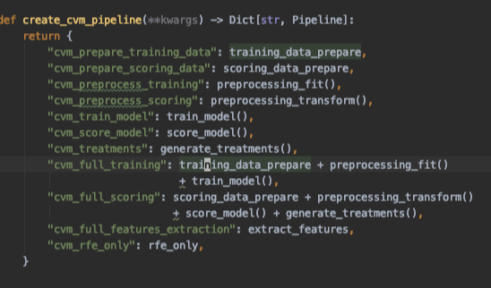
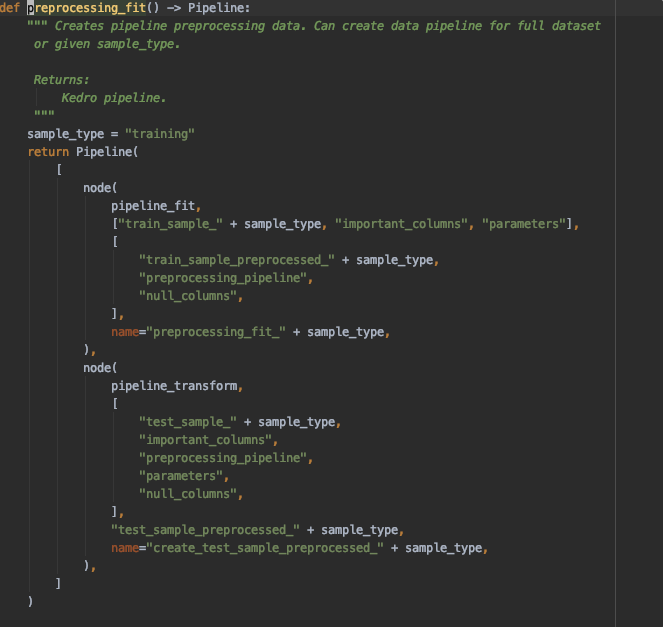
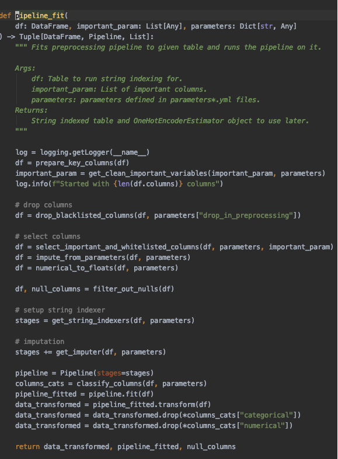
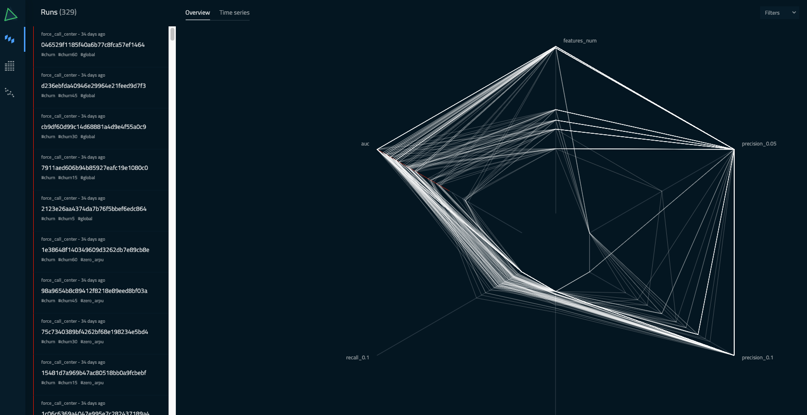
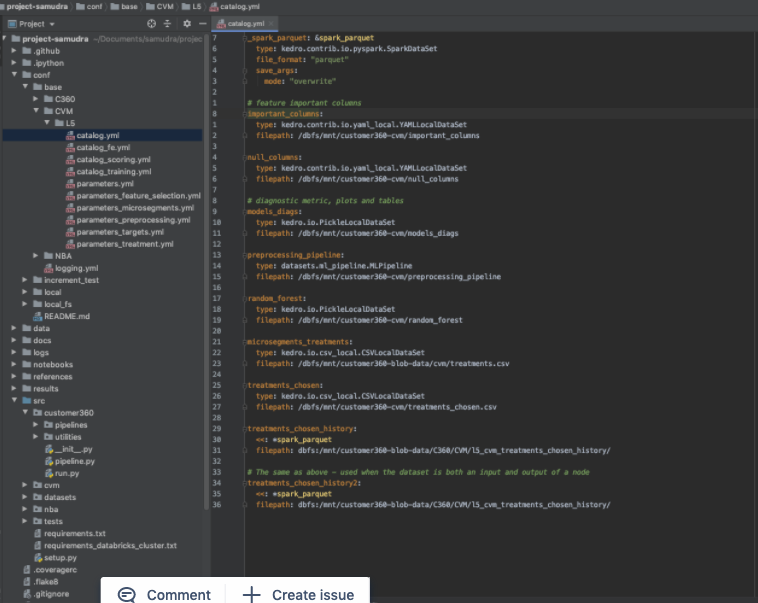
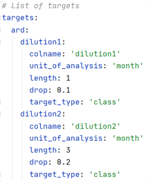
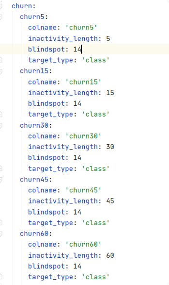
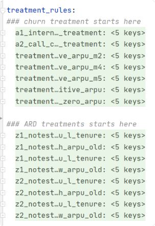
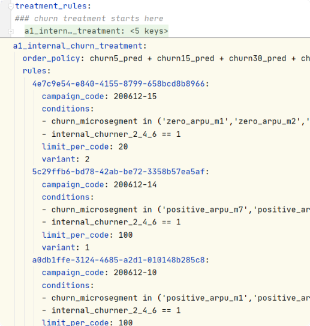

# How tos

### How to explore the code?
Imagine you ask yourself 'how is scoring performed?' or 'when microsegments are created?'.
To answer these question the best way is to check it in the code or documentation.
Since we use `kedro` to keep track of the pipelines, the code follows specific structure.

The projects code is organized into pipelines. Pipeline is set of nodes (functions) and data
(could parquet tables, csv files, etc). All pipelines are stored in `src/customer360/pipeline.py`.

To check the details of chosen pipeline right click on interesting part of code and 
choose `Go To` → `Declaration or Usages`.  

Now you should be transferred to declaration of used function.
Below nodes are listed. Node consists of function used, inputs, outputs and node name.

Node names can be used to run single nodes. Inputs and outputs refer to catalog names 
of dataset.

Let's look at the example, this is the definition of pipeline called `preprocessing_fit`.
It consists of two nodes. Every node has 4 arguments: function used,
catalog names of inputs, catalog names of outputs and a node name.
Let’s see the details of `pipeline_fit` function using `Go To` → `Declaration or Usages`.

We can see the details of fitting the preprocessing pipeline.

### How to modify microsegments?
Microsegments are built using the definition in file `conf/base/CVM/L5/parameters_microsegments.yml`.
Microsegments are assigned to users using the conditions stated below microsegment name in yaml file.
Check out function `cvm.src.utils.parametrized_features.build_feature_from_parameters` for more details.

### How to score for a different day?
1. Modify `scoring_experiment.chosen_date` in `conf/base/CVM/L5/parameters.yml` to desired one.
2. Run `cvm_full_scoring_experiment`.
3. Datasets are saved according to `conf/base/CVM/L5/catalog_scoring_experiment.yml`.

### How to modify assigned treatment codes?
Modify `conf/base/CVM/L5/parameters_treatment_rules.yml`.

### How to checkout models on PAI?
Forward port 5000 from 20.188.107.215 machine (ask k'Non for credentials).
Then the PAI is accessible on `localhost:5000`.

### How to retrain model?
Change experiment name in `parameters.yml`. Experiment name is the identifier used to
save models on PAI server. Then run `cvm_full_training` pipeline to retrain the model.
The existing model saved in `random_forest` will be overwritten. Old models can be restored 
from PAI server. Checkout PAI documentation on how to do it.

### How to change model type?
Modify the constructor of `sklearn` model in `src/cvm/modelling/nodes.py` and retrain the model.

If you want to change parameters / model itself, modify constructor above. Currently using
`RandomForestClassifier`.

### How to modify the preprocessing step?
To modify the preprocessing steps, modify nodes `preprocessing_fit` and `preprocessing_transform`
nodes located in `src/cvm/preprocessing/nodes.py`.

### How to browse through all the data set available?
Use C360 [confluence](https://customer360.atlassian.net/wiki/spaces/C3/overview)
documentation for list of tables and features.
 
Alternatively, explore catalog files in `conf/base/C360`. These contain list of C360 tables and paths.
For example, daily revenue tables are listed in `conf/base/C360/REVENUE/L1_DAILY/catalog.yml`.

Datasets used in our use case can be accessed in `conf/base/CVM/L5`.

Each entry is a datasets. The first line is the catalog name of the dataset.
 The same one as used in pipelines. Paths are included below.

### How to select input for model training?
Inputs are listed in `cvm.data_prep.pipeline.join_raw_features`. To add a new one add 
catalog name of desired dataset to sampling procedure and supply the sample to mentioned function.

### How to edit target for model training?
Targets following `churn` and `ard` logic are parametrized in `conf/base/CVM/L5/parameters_targets.yml`.

You can add 17 days churn with 15 days blindspot by modifying the mentioned file.
If you want to extend the targets logic modify functions building the targets: 
`cvm.data_prep.nodes.add_ard_targets` and `cvm.data_prep.nodes.add_ard_targets`.

### How to deploy campaign contact list from model?
Run node `deploy_treaments` from `cvm_full_scoring` pipeline.
If you want to deploy campaigns automatically set `skip_sending` to `"no"` in 
`conf/base/CVM/L5/parameters_treatment.yml`.

### How to run nodes in databricks?
To run selected node in databricks use 
[`main-kedro`](https://southeastasia.azuredatabricks.net/?o=334552184297553#notebook/904855813142769/command/904855813142776)
notebook template.
Remember to supply desired nodes and pipeline name.

### How to check the logging?
Logs are shown when the pipeline is run from notebook in the notebook itself.

These are also saved in clusters logs.

And on dbfs in path `/dbfs/mnt/customer360-blob-data/cvm/logs/`.

## Documentation how tos

### How to access and edit documentation?
The documentation can be accessed locally and is also hosted on `13.76.82.235` machine.
The source for the documentation is kept in `docs/source` directory.

### How to access hosted documentation?
Use `ssh` to forward port 2138 of pai-vm machine (13.76.82.235) and go to <http://localhost:2138>.

### How to forward port?
On Mac use command `ssh -l <login> 13.76.82.235 -L 2138:localhost:2138`.

On Windows use [putty](https://www.akadia.com/services/ssh_putty.html) to forward ports.

### How to access documentation locally?
Make sure you use the most recent version of `cvm/master` branch.
Build the documentation and open `docs/build/html/index.html` file.

### How to build docs locally?
Go to your local repository path. Use `sphinx` or kedro wrapper to build docs.

In order to use kedro run command `kedro build-docs`. 

Alternatively you can use sphinx to build docs.
Make sure you have sphinx installed.
Clean directory `docs/build` (that's where docs are saved) in your repo and run following commands:

To build the doc strings: `sphinx-apidoc --module-first -o docs/source src/cvm`.

To build rest of the document (i.e. introduction, FAQs) 
`sphinx-build -M html docs/source docs/build -a`.

Docs will be saved in `docs/build`.

### How to build hosted docs?
Run [this](https://southeastasia.azuredatabricks.net/?o=334552184297553#notebook/1429324376594167)
notebook. It clones the repository and updates the docs.
 This notebook is run daily to ensure docs stay up to date.

### How to modify docs?
To modify docs modify / add / delete files in folder `docs/source`. Use markdown.
More details [here](https://github.com/adam-p/markdown-here/wiki/Markdown-Cheatsheet).

For example: let's try to add another how to.

Make sure you use most recent version of code.

Open `docs/source`.

Open `04_howtos.md` and modify the file.

Use git to push the changes.

### How to update 
#### For generation and saving of YAML 
1. Receive the excel / CSV from team
2. Save the CSV in the same folder as your python notebook
3. Open the `convert to yaml.ipynb`, and make sure the `pandas.read_csv("XXXXX.csv")` is updated   
4. Run the commands to generate your desired yaml file

#### For saving treatment rules into the code base before daily scoring
1. Checkout to `cvm/master` (or relevant CVM model branch) on your git
1. Navigate to `conf\base\CVM\L5\parameters_treatment_rules.yml`
1. Delete and replace the Churn / ARD treatment rules section only
1. Commit the changes ( Ctrl + K ) using the label, `[treatments] Update rules xxxx `, 
where xxx could denote `ARD / Churn, date yyyymmdd, for reason`
1. Push the changes 
1. (optional) Check that changes have been pushed to repository

Treatment rules in the yaml file starts with churn, then ARD as below

Pro tip: 
- Use `Ctrl Shift -` to collapse all
- Use `Ctrl Shift +` to expand all
- Point your cursor on the collapse tree to quickly inspect it's contents
 
 
